# 🛡️ IMGSTG: Multi-Media Steganography & Dual-Layer Encryption Platform

<p align="center">
  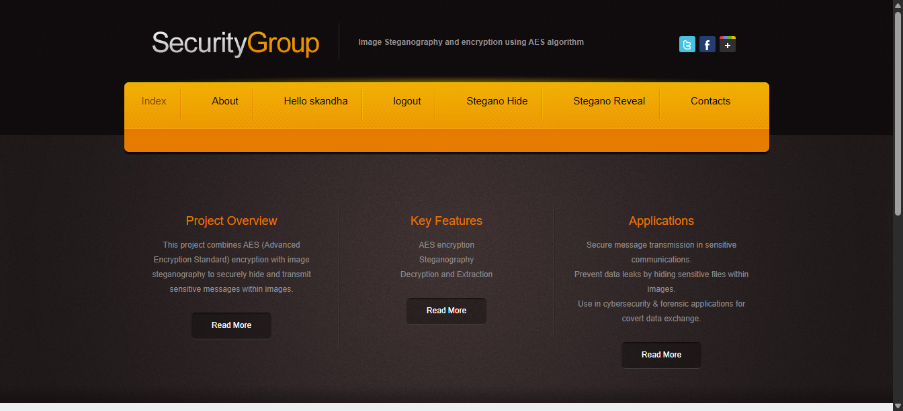
</p>

<p align="center">
  <a href="https://github.com/skandhaavadhani25/IMGSTG"></a>
  
  
  
  
  
</p>

---

## 📖 Table of Contents

- [Overview](#-overview)
- [Why Dual-Layer Security?](#-why-dual-layer-security)
- [System Architecture](#-system-architecture)
- [Core Features & Supported Media](#-core-features--supported-media)
  - [1. Image Steganography](#1-image-steganography)
  - [2. Video Steganography](#2-video-steganography)
  - [3. Audio Steganography](#3-audio-steganography)
- [Screenshots & Visual Walkthrough](#-screenshots--visual-walkthrough)
  - [Main Dashboard & Navigation](#main-dashboard--navigation)
  - [Steganography Media Selection Hub](#steganography-media-selection-hub)
  - [Image Steganography Workflow](#image-steganography-workflow)
  - [Video Steganography Workflow](#video-steganography-workflow)
  - [Audio Steganography Workflow](#audio-steganography-workflow)
  - [Project Knowledge Base & Applications](#project-knowledge-base--applications)
  - [User Authentication & Contact Portal](#user-authentication--contact-portal)
- [Project Directory Structure](#-project-directory-structure)
- [Cryptographic & Steganographic Technical Specifications](#-cryptographic--steganographic-technical-specifications)
- [Installation & Quick Start](#-installation--quick-start)
- [Step-by-Step Usage Guide](#-step-by-step-usage-guide)
- [Real-World Applications](#-real-world-applications)
- [Security Considerations](#-security-considerations)
- [Author & Acknowledgements](#-author--acknowledgements)

---

## 🌟 Overview

**IMGSTG** is a comprehensive **Dual-Layer Cybersecurity and Covert Communication Web Application** built with Python and Django. It integrates the **Advanced Encryption Standard (AES) / Fernet symmetric cryptography** with **Least Significant Bit (LSB) Multi-Media Steganography** across **Images**, **Videos**, and **Audio** streams.

Traditional cryptography ensures message confidentiality, but ciphertext is noticeably conspicuous to eavesdroppers and automated network sniffers. Pure steganography hides data within harmless media, but if an adversary inspects the raw binary bits, the plaintext is exposed. 

**IMGSTG eliminates both weaknesses by enforcing dual-layer defense:**
1. **Layer 1 (Cryptographic Scrambling):** The payload is encrypted using industrial-grade symmetric encryption (AES / Fernet / PBKDF2HMAC) or dynamic key-stream XOR ciphers.
2. **Layer 2 (Steganographic Concealment):** The resulting cipher data is imperceptibly embedded into the binary structure of digital cover media (lossless image pixels, uncompressed video frames, or raw audio waveforms).

An interceptor observes only an ordinary multimedia file, completely unaware that sensitive data is concealed within. Even in the unlikely event of steganographic discovery, the intercepted payload remains indecipherable without the cryptographic secret key.

---

## 🛡️ Why Dual-Layer Security?

| Security Dimension | Traditional Cryptography Alone | Pure Steganography Alone | Dual-Layer IMGSTG Platform |
| :--- | :--- | :--- | :--- |
| **Visibility** | Obvious ciphertext (invites cryptanalysis & interception) | Completely hidden in cover media | **Completely hidden in cover media** |
| **Data Protection** | High cryptographic security | Zero protection once extracted | **Dual protection (Hidden + Encrypted)** |
| **Channel Defense** | Vulnerable to censorship & blocking | Vulnerable to steganographic discovery | **Bypasses censorship & resists cracking** |
| **Integrity** | Protected via MAC / Hash | Fragile | **Protected by PBKDF2HMAC & verification** |
| **Media Types** | Raw text / binary files | Often limited to single media | **Full Tri-Media: Image, Video, & Audio** |

---

## 🏗️ System Architecture

IMGSTG is architected according to Django's **Model-View-Template (MVT)** design pattern, coupled with specialized cryptographic and multimedia signal processing engines.

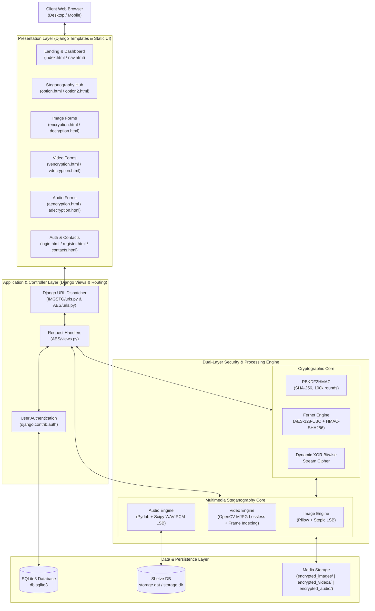

---

## ⚙️ Core Features & Supported Media

### 1. Image Steganography
- **Cover Formats Supported:** PNG, JPEG, BMP, WebP (automatically normalized to lossless RGBA PNG to preserve pixel fidelity).
- **Steganographic Method:** Least Significant Bit (LSB) byte-level modulation using the `stepic` library and `Pillow (PIL)`.
- **Payload:** Plaintext and binary text streams encoded in UTF-8.
- **Output:** Lossless PNG image saved into `encrypted_images/` without perceptible visual distortion.
- **Decoding:** Exact LSB bitstream reconstruction back into UTF-8 text strings.

### 2. Video Steganography
- **Video Processing Engine:** OpenCV (`cv2`).
- **Cryptographic Derivation:**
  - Password stretching via **PBKDF2HMAC** with **SHA-256**, **100,000 iterations**, and a cryptographically secure 16-byte random salt (`os.urandom(16)`).
  - High-assurance encryption using **Fernet** (AES-128 in CBC mode with PKCS7 padding and HMAC-SHA256 authentication).
- **Lossless Frame Writing:** Motion JPEG (`MJPG`) codec prevents spatial/temporal compression from degrading embedded payload bits.
- **Spatial Positioning:** Target frame embedding (default frame index 10) with corner boundary marking.
- **Sidecar Synchronization:** Metadata package (salt, ciphertext, and target frame) persisted via Python `pickle` into a `.data` sidecar file for tamper-evident extraction.

### 3. Audio Steganography
- **Audio Processing Engine:** `pydub` and `scipy.io.wavfile`.
- **Pre-Processing Pipeline:** Uploaded MP3 audio files are converted into uncompressed single-channel mono 16-bit PCM WAV at native sample rates.
- **Cryptographic Scrambling:** Dynamic XOR key-stream cipher using dynamic cyclic key wrapping.
- **Acoustic Modulation:** Low-order bit manipulation (`(sample & ~1) | bit`) on audio waveform samples, inaudible to human auditory perception.
- **Length Synchronization:** Precise payload bit-lengths are stored in Python `shelve` persistent storage (`storage.dat`, `storage.dir`) ensuring noise-free extraction.

---

## 📸 Screenshots & Visual Walkthrough

### Main Dashboard & Navigation

#### 1. Authenticated User Dashboard
Once logged in, users gain full access to the **Stegano Hide** and **Stegano Reveal** suites, along with personalized greeting and session management.

<p align="center">
  
</p>

#### 2. Public Landing Page
Clean, responsive interface presenting project mission, technical overview, and key features.

<p align="center">
  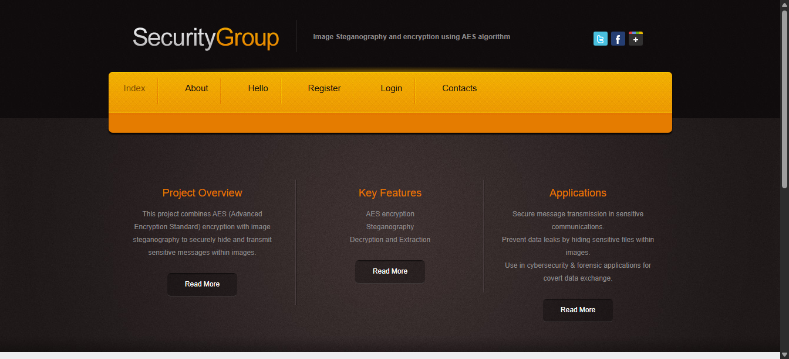
</p>

---

### Steganography Media Selection Hub

#### 3. Stegano Hide Hub (`/option`)
Dedicated selection hub allowing authenticated users to choose their desired covert carrier medium: **Image**, **Video**, or **Audio**.

<p align="center">
  
</p>

#### 4. Stegano Reveal Hub (`/option2`)
Mirrored decoding hub facilitating straightforward extraction from steganographic carrier media.

<p align="center">
  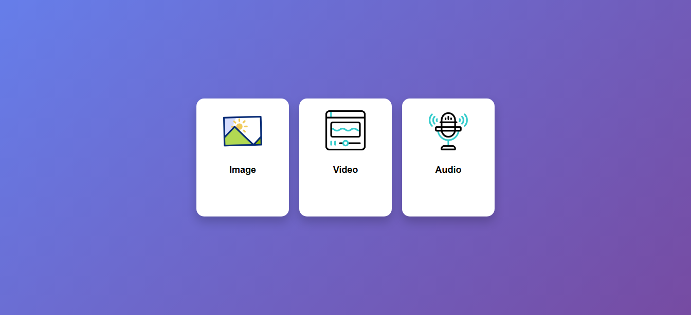
</p>

---

### Image Steganography Workflow

#### 5. Image Hide Interface (`/encryption/`)
Upload a cover image and input your confidential text message to generate a stego-image with zero perceptible degradation.

<p align="center">
  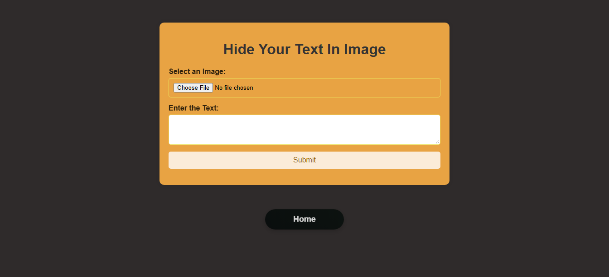
</p>

#### 6. Image Reveal Interface (`/decryption/`)
Upload an encoded stego-image to extract and display the concealed secret message.

<p align="center">
  
</p>

---

### Video Steganography Workflow

#### 7. Video Hide Interface (`/vencryption/`)
Upload a video file to embed AES/Fernet-encrypted data within a targeted video frame using lossless Motion JPEG encoding.

<p align="center">
  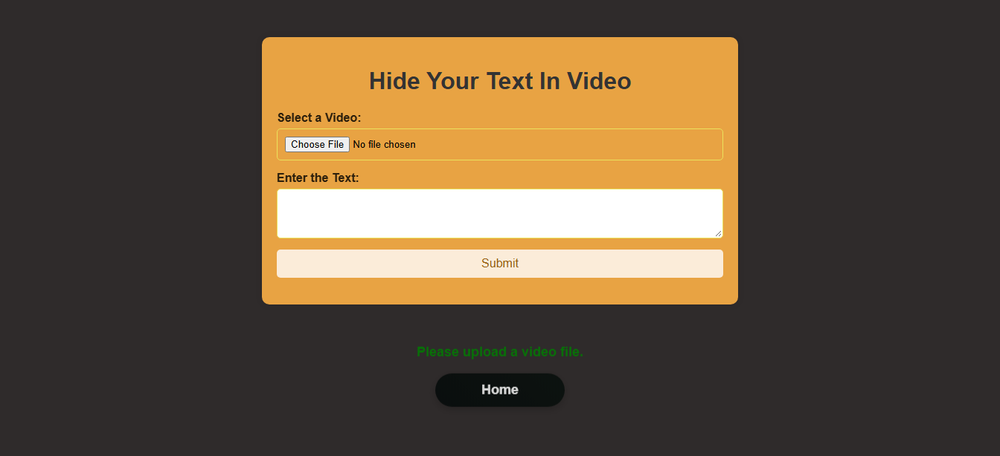
</p>

#### 8. Video Reveal Interface (`/vdecryption/`)
Upload the stego-video alongside its sidecar metadata to decrypt and recover the original plaintext.

<p align="center">
  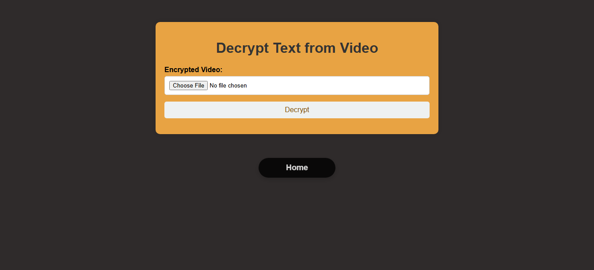
</p>

---

### Audio Steganography Workflow

#### 9. Audio Hide Interface (`/aencryption/`)
Upload audio tracks (MP3 or WAV) to embed XOR-scrambled data into low-order acoustic waveform samples.

<p align="center">
  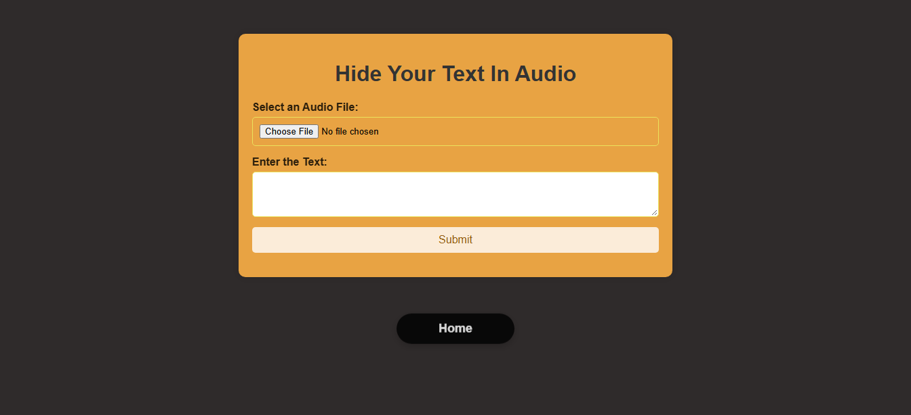
</p>

#### 10. Audio Reveal Interface (`/adecryption/`)
Extract the embedded payload from the stego-audio track and decrypt it into clean plaintext.

<p align="center">
  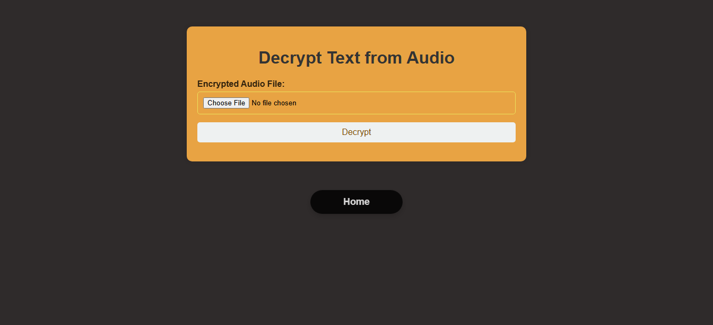
</p>

---

### Project Knowledge Base & Applications

#### 11. Project Overview (`/overview`)
Comprehensive technical background detailing AES principles, LSB concepts, and the dual-layer security paradigm.

<p align="center">
  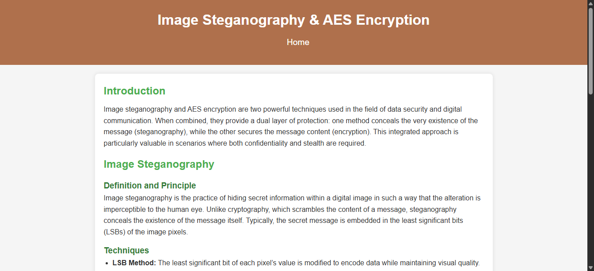
</p>

#### 12. Key Cryptographic Features (`/key`)
In-depth breakdown of symmetric key characteristics, block cipher attributes, and anti-tamper mechanisms.

<p align="center">
  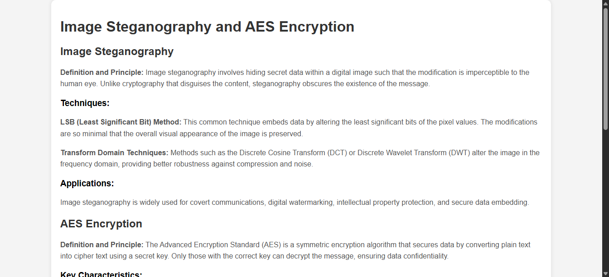
</p>

#### 13. Practical Applications (`/application`)
Detailed exploration of real-world use cases across military, healthcare (HIPAA compliance), banking, and forensics.

<p align="center">
  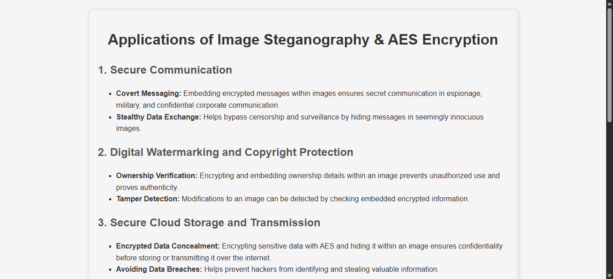
</p>

---

### User Authentication & Contact Portal

#### 14. User Registration (`/register`)
Account creation portal backed by Django's secure password-hashing authentication system.

<p align="center">
  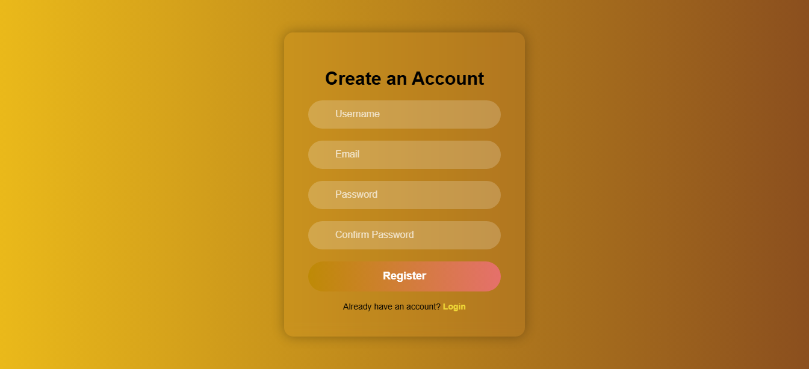
</p>

#### 15. User Login (`/login`)
Secure session authentication protecting steganography operations from unauthorized access.

<p align="center">
  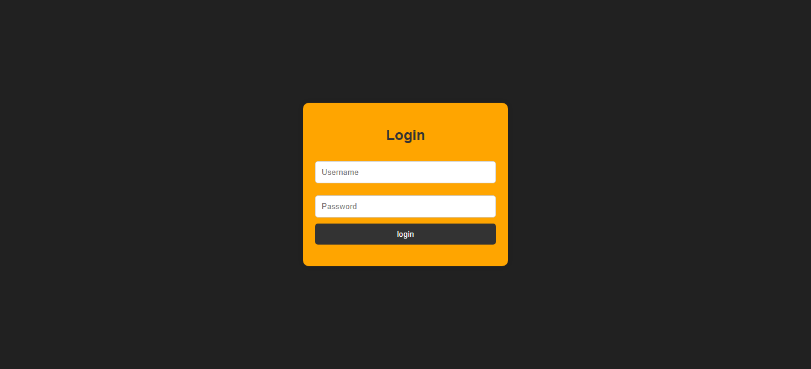
</p>

#### 16. Contact & Support (`/contacts`)
Interactive inquiry form for technical feedback and collaboration.

<p align="center">
  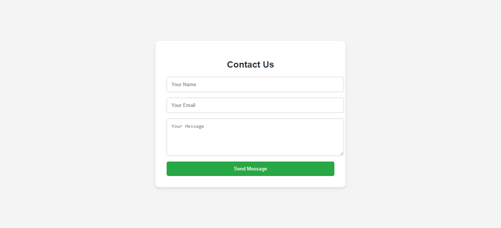
</p>

---

## 📂 Project Directory Structure

```plaintext
IMGSTG/
├── AES/                               # Core Application Module
│   ├── migrations/                    # Database migration history
│   ├── admin.py                       # Django administrative configurations
│   ├── apps.py                        # App configuration class
│   ├── models.py                      # Data models
│   ├── tests.py                       # Unit tests
│   ├── urls.py                        # App route definitions (17 endpoints)
│   └── views.py                       # Steganography & Crypto logic controllers
├── IMGSTG/                            # Django Project Orchestration
│   ├── asgi.py                        # ASGI asynchronous deployment entry
│   ├── settings.py                    # Global Django settings & static config
│   ├── urls.py                        # Root URL dispatcher
│   └── wsgi.py                        # WSGI server entry point
├── db.sqlite3                         # Local SQLite3 database (User authentication)
├── manage.py                          # Django CLI management utility
├── requirements.txt                   # Production dependency manifest
├── .gitignore                         # Version control ignore rules
├── storage.dat / storage.dir          # Persistent shelve database for audio payload length
├── encrypted_images/                  # Output storage for generated stego-images
├── encrypted_videos/                  # Output storage for generated stego-videos & .data sidecars
├── encrypted_audio/                   # Output storage for generated stego-audio files
├── screenshots/                       # High-resolution documentation screenshots (16 images)
├── static/                            # Static asset library
│   ├── css/                           # Custom stylesheets (style.css, reset.css)
│   ├── js/                            # JavaScript utilities (jQuery, OTP handlers)
│   └── images/                        # UI background graphics, icons, and button artwork
└── templates/                         # HTML5 Django Template Suite
    ├── nav.html                       # Global navigation bar & header template
    ├── index.html                     # Public homepage
    ├── about.html                     # About page
    ├── overview.html                  # In-depth architectural overview
    ├── key.html                       # Cryptographic key characteristics
    ├── application.html               # Practical industry applications
    ├── option.html                    # Stegano Hide media selector (Image/Video/Audio)
    ├── option2.html                   # Stegano Reveal media selector (Image/Video/Audio)
    ├── encryption.html                # Image steganography encoder view
    ├── decryption.html                # Image steganography decoder view
    ├── vencryption.html               # Video steganography encoder view
    ├── vdecryption.html               # Video steganography decoder view
    ├── aencryption.html               # Audio steganography encoder view
    ├── adecryption.html               # Audio steganography decoder view
    ├── login.html                     # User authentication login view
    ├── register.html                  # User account creation view
    └── contacts.html                  # User feedback & contact view
```

---

## 🔬 Cryptographic & Steganographic Technical Specifications

### Video Steganography Mathematical Specification
1. **Key Derivation (KDF):**
   $$\text{Key} = \text{PBKDF2HMAC}(\text{Password}, \text{Salt}, \text{iterations}=100000, \text{hash}=\text{SHA-256}, \text{length}=32)$$
2. **Cipher Engine:**
   $$\text{Ciphertext} = \text{Fernet}_{\text{Key}}(\text{Plaintext})$$
   Where $\text{Fernet}$ provides **AES-128-CBC** encryption with **PKCS7 padding** and **HMAC-SHA256** integrity verification.
3. **Lossless Encoding:**
   Video frames are encoded via the `MJPG` codec, ensuring that pixel discrete cosine transform coefficients are not subjected to destructive inter-frame compression.

### Audio Steganography Bitwise Specification
1. **Bitwise XOR Stream Cipher:**
   $$C_i = P_i \oplus K_{(i \bmod |K|)}$$
2. **Audio Sample Bit Substitution:**
   $$S'_i = (S_i \ \& \ \sim 1) \ | \ B_i$$
   Where $S_i$ is the 16-bit PCM waveform sample and $B_i \in \{0, 1\}$ is the $i$-th bit of the encrypted payload.
3. **Imperceptibility Guarantee:**
   Modifying only bit 0 induces an amplitude variation of at most $\pm 1$ out of $65,536$ levels (less than $0.0015\%$), well below human auditory detection thresholds.

---

## 🚀 Installation & Quick Start

### Prerequisites
- **Python:** Version `3.10` or higher (`3.11`, `3.12`, `3.13`, `3.14` fully supported)
- **Git:** Installed and available on your system `PATH`
- **FFmpeg (Optional):** Recommended for enhanced audio codec conversions

### Step 1: Clone the Repository
```bash
git clone https://github.com/skandhaavadhani25/IMGSTG.git
cd IMGSTG
```

### Step 2: Create and Activate a Virtual Environment
- **On Windows (PowerShell):**
  ```powershell
  python -m venv venv
  .\venv\Scripts\Activate.ps1
  ```
- **On Linux / macOS:**
  ```bash
  python3 -m venv venv
  source venv/bin/activate
  ```

### Step 3: Install Required Dependencies
```bash
pip install -r requirements.txt
```

> **Note for Python 3.13+ Users:** Standard library `audioop` was removed in Python 3.13. `requirements.txt` automatically includes `audioop-lts` to maintain 100% compatibility.

### Step 4: Apply Database Migrations
```bash
python manage.py migrate
```

### Step 5: (Optional) Create a Superuser
```bash
python manage.py createsuperuser
```

### Step 6: Start the Development Server
```bash
python manage.py runserver
```

Open your browser and navigate to:
```
http://127.0.0.1:8000/
```

---

## 🕹️ Step-by-Step Usage Guide

### Hiding Secret Data (Stegano Hide)
1. **Log In:** Navigate to `/login` and sign in with your credentials (or register at `/register`).
2. **Access Hub:** Click **Stegano Hide** in the top navigation bar (or navigate to `/option`).
3. **Select Medium:**
   - **Image:** Upload a `.png` or `.jpg` cover image, enter your secret message, and click **Submit**. The stego-image is saved in `encrypted_images/`.
   - **Video:** Upload a `.mp4` or `.avi` video file, enter your secret message, and click **Submit**. The encrypted stego-video and its `.data` sidecar file are saved in `encrypted_videos/`.
   - **Audio:** Upload a `.mp3` or `.wav` audio track, enter your secret message, and click **Submit**. The stego-audio track is saved in `encrypted_audio/`.

### Revealing Secret Data (Stegano Reveal)
1. **Access Hub:** Click **Stegano Reveal** in the top navigation bar (or navigate to `/option2`).
2. **Select Medium:**
   - **Image:** Upload the generated stego-image to extract and view the concealed text.
   - **Video:** Upload the stego-video file. The engine validates the sidecar metadata, decrypts the AES payload, and outputs the plaintext.
   - **Audio:** Upload the stego-audio track. The engine reads the sample bitstream, applies the XOR key, and renders the extracted text.

---

## 🌍 Real-World Applications

- 🎖️ **Covert Military & Intelligence Operations:** Secure field communications across hostile monitoring channels without raising suspicion.
- 📰 **Journalist & Whistleblower Protection:** Exfiltrating confidential documents and witness accounts through censorship firewalls.
- © **Digital Watermarking & Intellectual Property:** Embedding tamper-proof, encrypted ownership certificates inside proprietary graphics, songs, and film.
- 🏥 **Healthcare & Medical Record Confidentiality:** Hiding and encrypting patient diagnostic histories within DICOM/MRI/CT medical imagery in strict compliance with HIPAA standards.
- 💳 **Banking & FinTech Anti-Fraud:** Concealing cryptographic transaction authenticators inside banking invoices and digital receipts.

---

## 🔒 Security Considerations

1. **Cover Media Capacity:** Embedding large payloads into small cover files can cause detectable statistical anomalies. Ensure the cover file contains sufficient samples/pixels for the desired payload size.
2. **Lossy Compression Warning:** Uploading stego-images or stego-audio to platforms that re-encode media (such as WhatsApp, Facebook, or Twitter) can strip or alter the LSB bits. For end-to-end transmissions, send files as uncompressed documents (lossless PNG/WAV).
3. **Sidecar Preservation:** Video steganography requires the `.data` metadata file for PBKDF2 salt and frame synchronization during decryption.

---

## 👤 Author & Acknowledgements

- **Repository Owner:** [skandhaavadhani25](https://github.com/skandhaavadhani25)
- **Project Repository:** [IMGSTG on GitHub](https://github.com/skandhaavadhani25/IMGSTG)

---

<p align="center">
  <b>Developed with ❤️ for Advanced Cyber Defense & Secure Covert Communications.</b>
</p>
